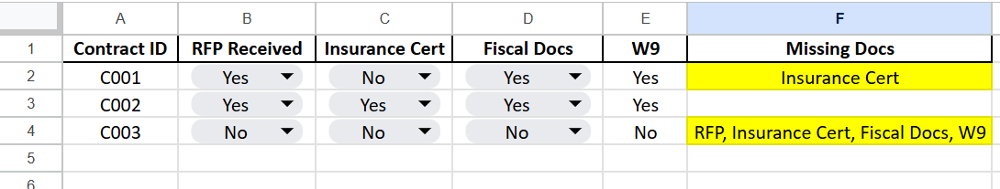

# 📄 Contract Compliance Tracker (Google Sheets Project)

**A Google Sheets-based system to track city contract milestones, ensure document compliance, and monitor invoice approvals.**

---

## 📊 Overview

This tool simulates the responsibilities of a Technical Assistance Analyst at a city agency like the Mayor's Office of Criminal Justice (MOCJ). It helps manage vendor documentation, monitor RFP milestones, and track invoice approval status using automation and formatting features in Google Sheets.

---

## 📋 Sheet Descriptions

### 1. **Contract Overview**
Tracks key contract data:
- Contract ID
- Vendor Name
- Start & End Dates
- Contract Value
- Milestone Schedule
- Current Status

### 2. **Document Compliance**
Tracks submission of key required documents:
- RFP Response
- Insurance Certificate
- W9
- Fiscal Documentation  
Uses conditional formatting to flag missing documents automatically.

### 3. **Invoice Log**
Monitors:
- Invoice # and Dates
- Amounts Submitted
- Approval Status
- Notes (e.g. “Missing backup” or “On hold”)

A pie chart summarizes invoice status (Approved vs Not Approved).

---

## 🧠 Skills Demonstrated

- Google Sheets automation & formulas
- Data validation and dropdown lists
- Conditional formatting for compliance visibility
- Visual summary via charts
- Multi-sheet data management
- Simulated procurement workflows

---

## 📸 Screenshots

### Contract Overview  

### Document Compliance  

### Invoice Log + Chart  
  

---

## 🔗 View the Live Google Sheet

👉 [Click to View Sheet (Read-Only)](https://docs.google.com/spreadsheets/d/1BYY-luyahvyS-SVtFyoyHsgQs42g59g9LSPp3OuYMLU/edit?usp=sharing)

---

## 🧩 Project Use Case

Ideal for use by nonprofit organizations, government agencies, or community vendors who manage multiple city contracts. Useful in roles involving:
- Contract oversight
- Technical assistance
- Budget/fiscal review
- Vendor documentation compliance
